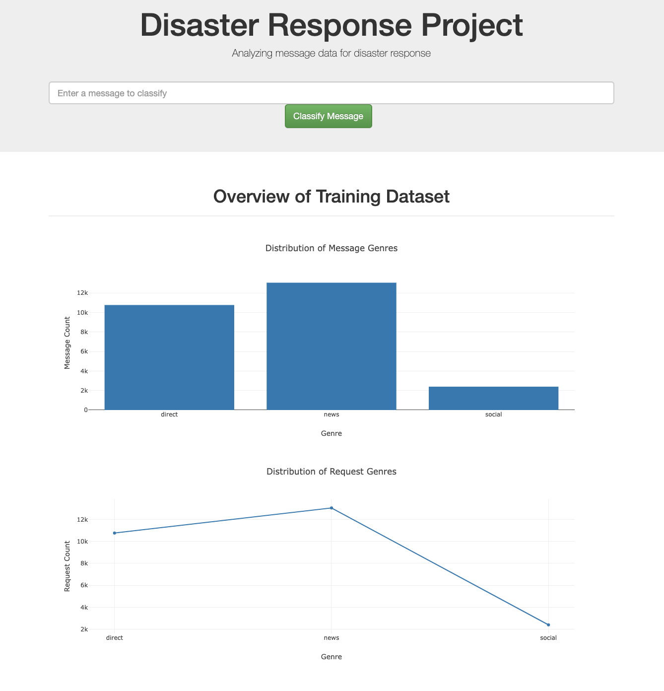
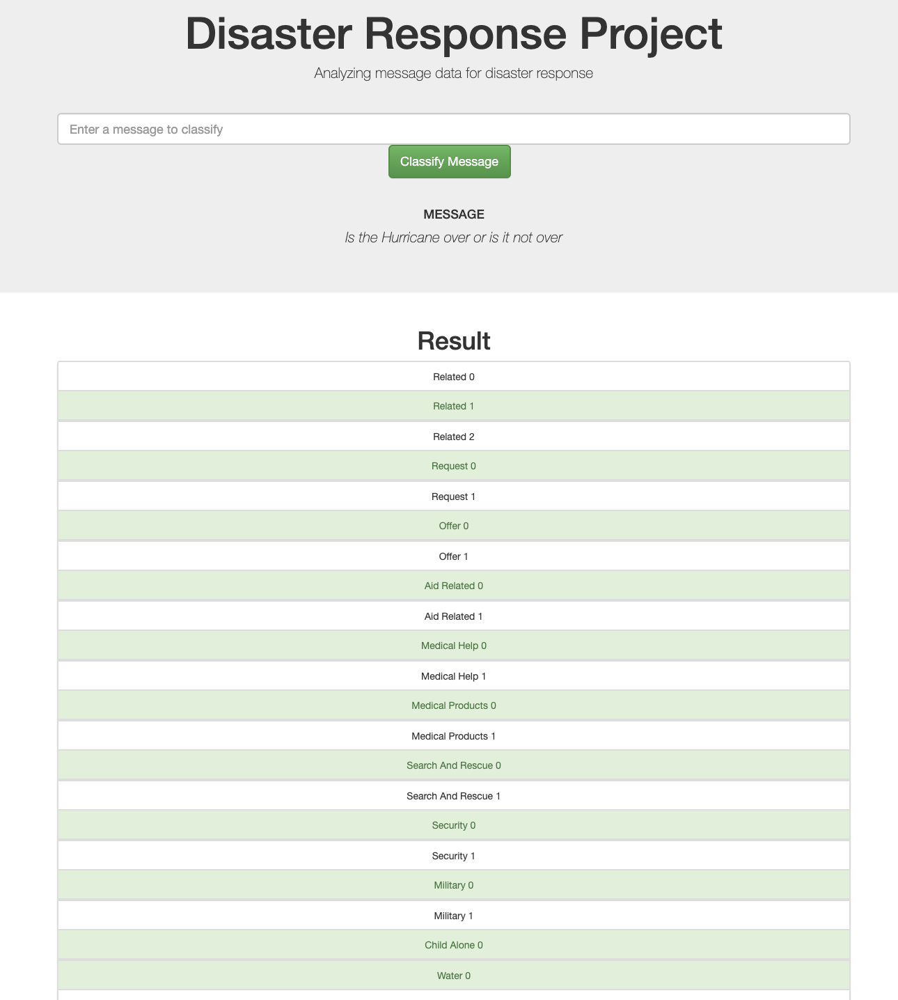

# Disaster Response Pipeline Project 

### Motivation
In this project I apply learned data engineering skills to expand my opportunities and potential as a data scientist. In particular, I'll apply these skills to analyze disaster data from [Figure Eight](https://www.figure-eight.com/) to build a model for an API that classifies disaster messages.

  
  

### Installation Instructions:
1. Run the following commands in the project's root directory to set up your database and model.
    - Download the csv files disaster_messages.csv and disaster_categories.csv into the data directory.
      `NOTE: I cannot upload these csv files into Github due to limited size.`

    - To run ETL pipeline that cleans data and stores in database
        `python data/process_data.py data/disaster_messages.csv data/disaster_categories.csv data/DisasterResponse.db`
    - To run ML pipeline that trains classifier and saves
        `python models/train_classifier.py data/DisasterResponse.db models/classifier.pkl`

2. Run the following command in the app's directory to run your web app.
    - Setup environment variable 
    PYTHONPATH=$PYTHONPATH:/Users/jadehuang/machine-learning/Udacity/project2/models
    export PYTHONPATH

    - run application 
    `python run.py`

3. Go to http://0.0.0.0:3001/

### Acknowledgments
I would like to thank Udacity for its excellent data scientist training program and project review, and Figure Eight for the dataset.

